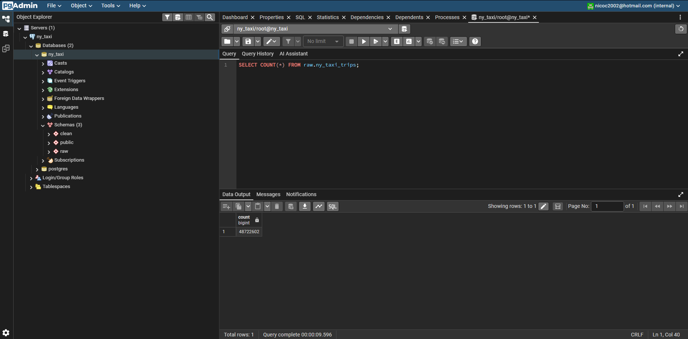
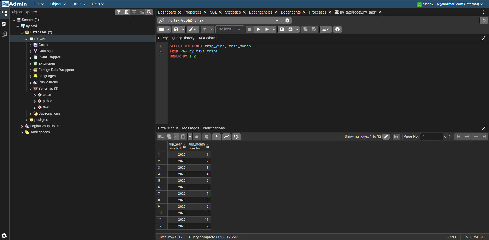
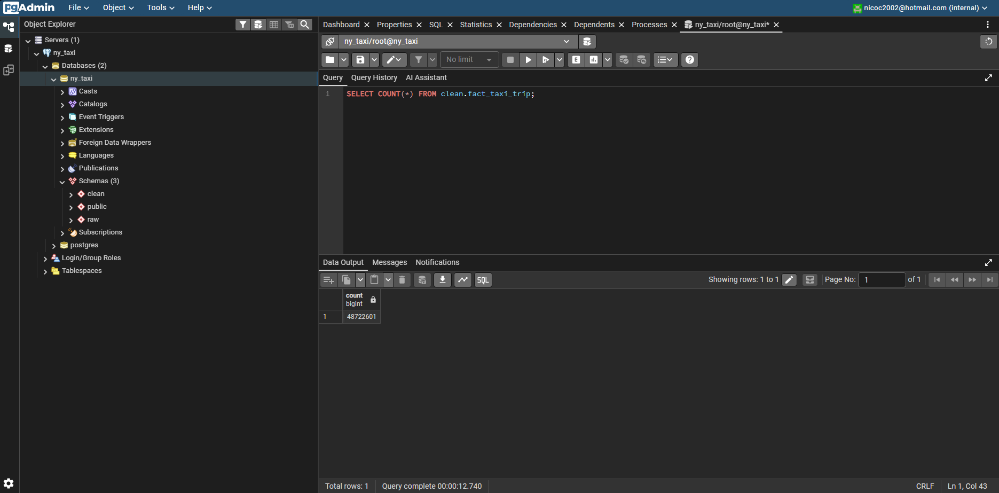
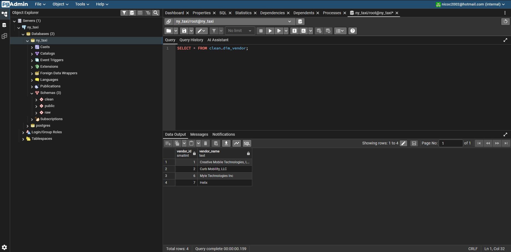
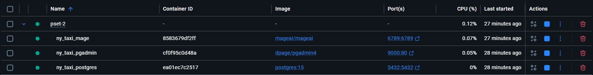
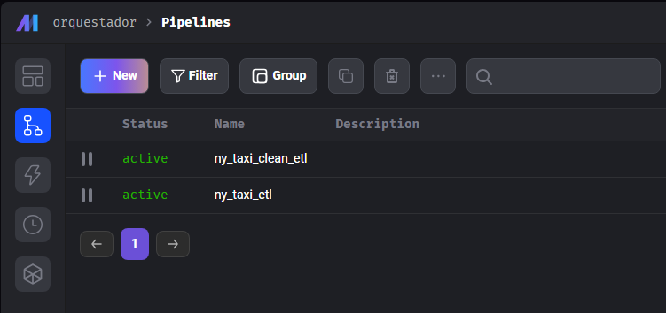
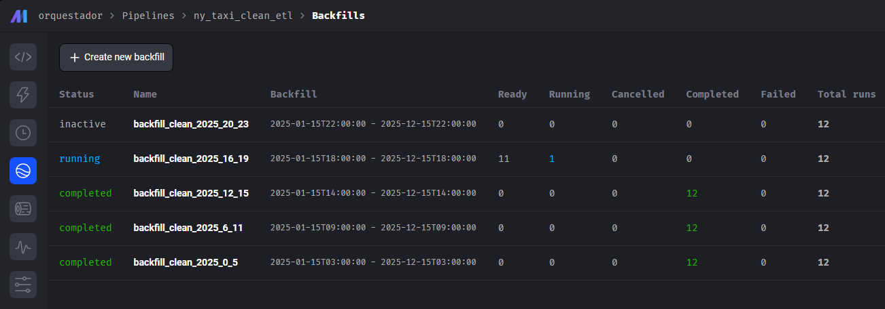
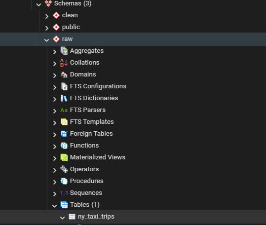
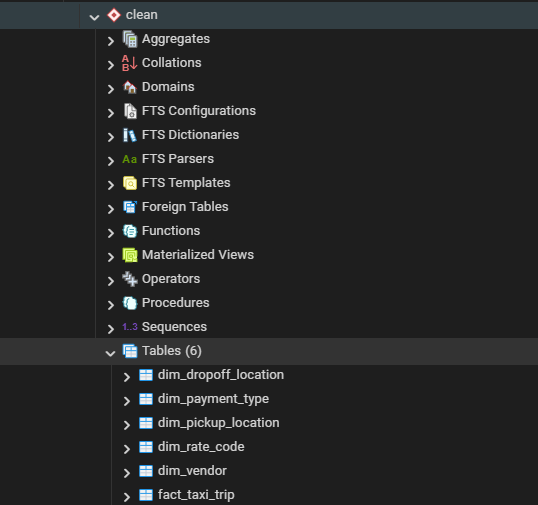

# PSet #2 — NY Taxi ELT Pipeline

## Objetivo del proyecto

El objetivo de este proyecto es diseñar e implementar una solución end-to-end para la ingestión, almacenamiento y transformación de datos del dataset de viajes de taxi de Nueva York, utilizando un enfoque ELT (Extract, Load, Transform).

Se construyen dos pipelines independientes: uno para la carga de datos crudos en una capa `raw` y otro para la transformación y modelamiento en una capa `clean`. La solución está completamente orquestada con Mage y desplegada localmente mediante Docker Compose.


## Arquitectura

El sistema sigue el siguiente flujo:

Fuente NY Taxi → Pipeline raw (Mage) → PostgreSQL (schema raw) → Pipeline clean (Mage) → PostgreSQL (schema clean) → pgAdmin

Componentes principales:

* Mage: orquestación de pipelines
* PostgreSQL: almacenamiento de datos
* pgAdmin: exploración y validación
* Docker Compose: despliegue de servicios


## Pasos para levantar el entorno

1. Clonar el repositorio y ubicarse en el directorio del proyecto.
2. Ejecutar (asegurarse que Docker Desktop esté corriendo):

```bash
docker-compose up
```

3. Verificar que los servicios estén activos. 
4. Abrir [Mage](http://localhost:6789) y [PgAdmin](http://localhost:9000) en el explorador.


## Ejecución de pipelines

Se implementan dos pipelines en Mage:

### Pipeline raw: `ny_taxi_etl`

* Extrae datos desde la fuente oficial
* Carga datos en `raw.ny_taxi_trips`
* Agrega columnas `trip_year` y `trip_month`

### Pipeline clean: `ny_taxi_clean`

* Lee datos desde la capa raw
* Aplica transformaciones y validaciones
* Construye un modelo dimensional en la capa clean

Ambos pipelines utilizan `execution_date` y se ejecutan mediante backfills mensuales.
En el caso del pipeline clean, el procesamiento se subdivide por intervalos horarios para evitar problemas de memoria.


## Acceso a pgAdmin

* URL: [http://localhost:9000](http://localhost:9000)
* Email: nicoc2002@hotmail.com
* Contraseña: root
* Host: postgres
* Puerto: 5432
* Base de datos: ny_taxi


## Validación de resultados en PostgreSQL

Ejemplos de validación:

```sql
SELECT COUNT(*) FROM raw.ny_taxi_trips;
```


```sql
SELECT DISTINCT trip_year, trip_month
FROM raw.ny_taxi_trips
ORDER BY 1,2;
```


```sql
SELECT COUNT(*) FROM clean.fact_taxi_trip;
```
<!--  -->

```sql
SELECT * FROM clean.dim_vendor;
```



## Decisiones de diseño

* Separación clara entre capa raw y clean
* Uso de `execution_date` para procesamiento incremental
* Implementación de backfills para carga histórica
* Subdivisión del pipeline clean por horas para optimizar uso de memoria
* Idempotencia garantizada mediante eliminación por partición antes de cada carga


## Schemas, tablas y relaciones

### Schema raw

Tabla: `raw.ny_taxi_trips`
Contiene datos crudos con mínima transformación. Incluye columnas auxiliares `trip_year` y `trip_month`.

### Schema clean

#### Tabla de hechos

`clean.fact_taxi_trip`
Granularidad: un viaje por fila
Incluye métricas como distancia, monto total, propina y duración del viaje.

#### Tablas de dimensiones

* `clean.dim_vendor`
* `clean.dim_payment_type`
* `clean.dim_rate_code`
* `clean.dim_pickup_location`
* `clean.dim_dropoff_location`

Relaciones basadas en los identificadores presentes en la tabla de hechos.


## Evidencia visual

Servicios corriendo en Docker:


Pipelines en Mage:


Backfills configurados:


Tablas en schema raw:


Tablas en schema clean:


Consultas en pgAdmin:
